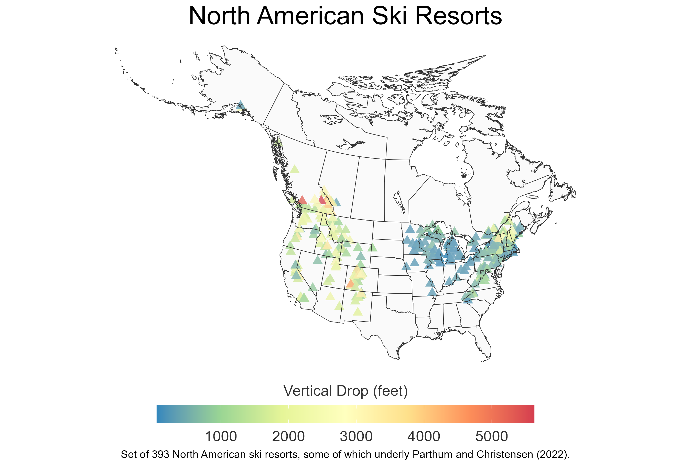

# North American Ski Resorts

This repo contains the location of 393 ski resorts across the United States and Canada, along with some descriptive characteristics of these resorts at the time the data were constructed. Some of these data were used for the publication by [Parthum and Christensen (2022)](https://doi.org/10.1016/j.jeem.2022.102637): "A Market for Snow: Modeling Winter Recreation Patterns Under Current and Future Climate".  

> **Abstract:** 
> Throughout the winter months across the globe, mountain communities and snow enthusiasts alike anxiously monitor ever-changing snowpack conditions. We model the behavioral response to this climate amenity by pairing a unique panel of 12 million short-term property rental transactions with daily local weather, daily local snowpack, and daily local snowfall in every major ski resort market across the United States. Matching the spatial and temporal variation in the level of the amenity with that of related market transactions, we derive market-specific demand elasticities, explicitly accounting for substitution, to model recreation patterns throughout a typical season. Lastly, we combine downscaled projections of local snowpack under future climate scenarios to estimate within and across season trends in visitation during mid and late-century conditions. Our model predicts reductions in snow-related visitation of -40% to -60%, almost twice as large as previous estimates suggest. This translates to a lower-bound on the annual willingness to pay to avoid reductions in snowpack between $1.23 billion (RCP4.5) and $2.05 billion (RCP8.5) by the end of the century.

## Requirements
1. *R* is free and available for download [here](https://www.r-project.org/). The *RStudio* integrated development environment is useful for replication, it is free and available for download [here](https://www.rstudio.com/products/rstudio/).

2. Optional: *Github* is free and available for download [here](https://github.com/git-guides/install-git). *Github* is used to house this repository and by installing and using it to clone the repository one will simplify the replication procedure. However, a user could also simply download a zipped file version of this repository, unzip in the desired location and follow the replication procedures outlined below.

## Getting Started
Begin by cloning this repository. This can be done by clicking on the green "code" button in this repository and following those instructions, or by navigating in the terminal via the command line to the desired location of the cloned repository and then typing: 

```
git clone https://github.com/bryanparthum/north-america-ski-resorts.git
```

Alternatively, you can make a `fork` of this repository. This allows for developemnt on the `fork` while preserving its relationship with this repository.

## Resort Database

The database was constructed using the following sources:

 1. [OnTheSnow.com](https://www.onthesnow.com/) - resort name and characteristics were collected in fall of 2018 using the information publicly available on their website at that time. 
 2. Resorts were geolocated using [tidygeocoder](https://jessecambon.github.io/tidygeocoder/) in R. 24 of the resort/region pairs failed and were recovered manually via Google Maps.

Below is a plot of the 393 resorts in the dataset along with the estimated virtical terrain at each resort.



This plot can be replicated by first cloning/downloading this repository and, then, using R with the `north-american-ski-resorts.Rproj` to set the relative paths. From there, the script `code/resort_map.R` will draw the map.

## Additions and Revisions

Updates to this database are welcomed. Please submit a pull request or issue in this repository if you would like to become a contributor. 

## License
The software code contained within this repository is made available under the [MIT license](http://opensource.org/licenses/mit-license.php). The data and figures are made available under the [Creative Commons Attribution 4.0](https://creativecommons.org/licenses/by/4.0/) license.
